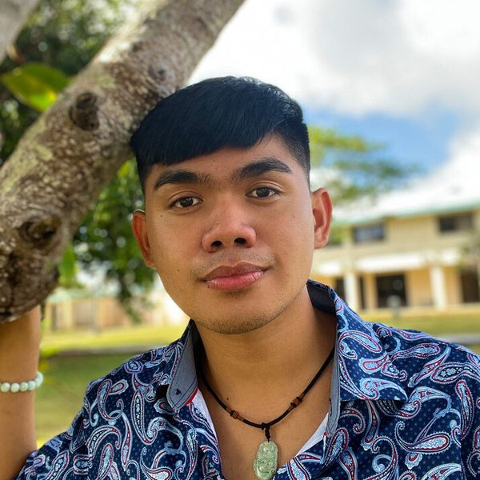
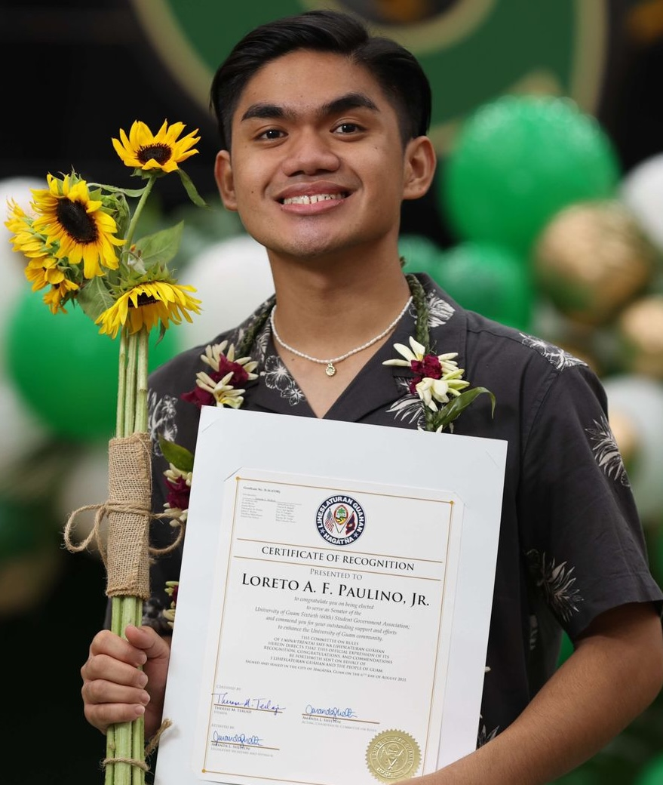
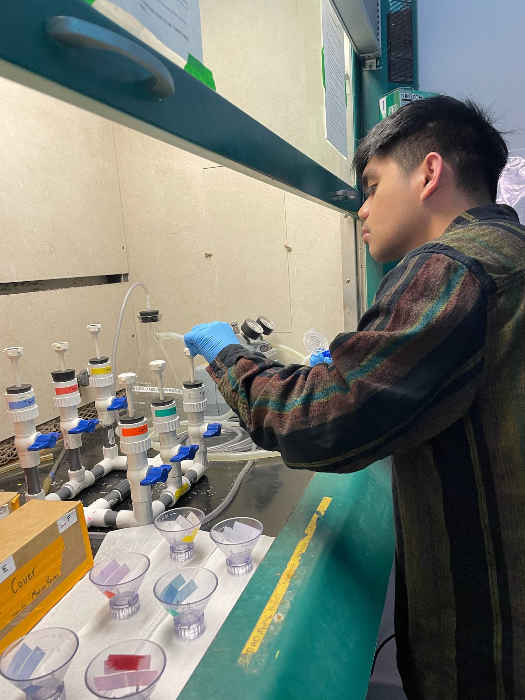
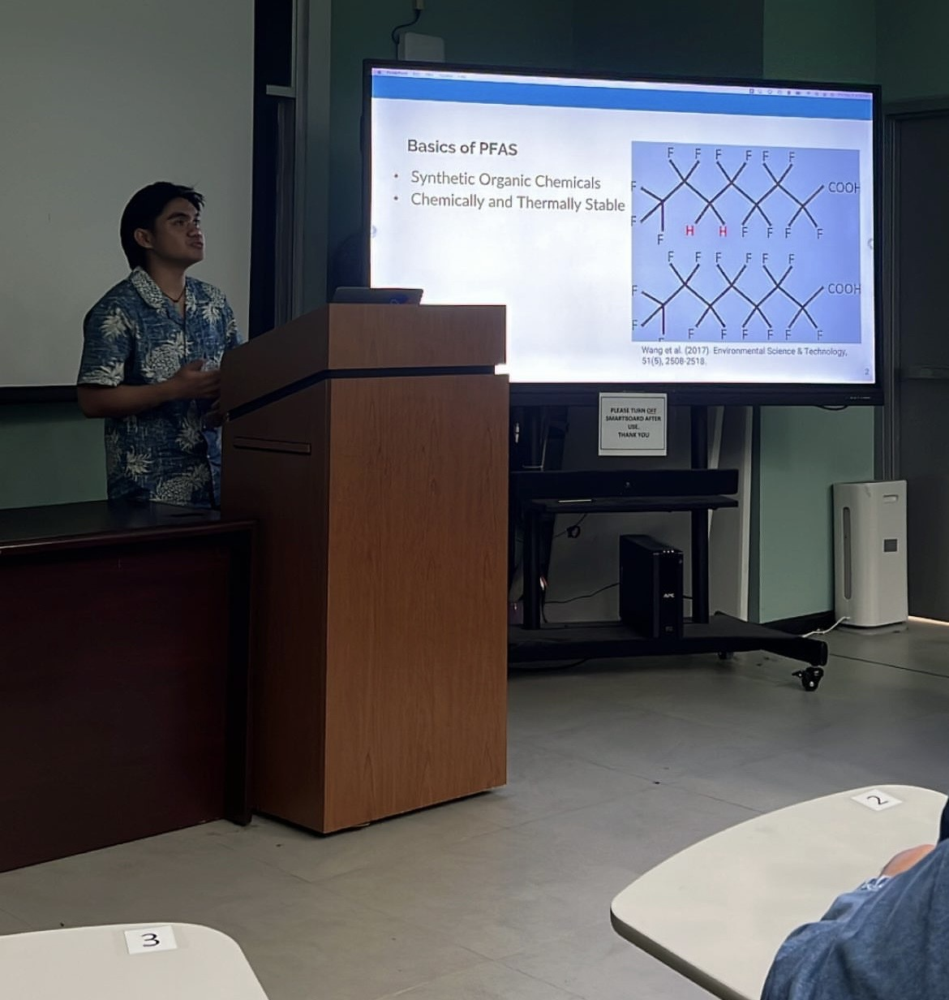

# About Me  

    
    

Hi, I'm **Loreto Paulino Jr.**, a researcher exploring the intricate connections between microbial networks and ocean biogeochemistry. 

I have a background in **chemistry and mathematics**, and my research integrates computational modeling, microbial ecology, and experimental approaches to study oceanic microbial communities. One of my current work focuses on understanding how marine heterotrophic bacteria produce dissolved organic matter, utilizing a probabilistic method to estimate for a producibility metric. 

---

## Media Features: Sharing My Story

Being featured in the media has given me an opportunity to share my journey, research, and the broader impact of my work. Each of these moments represents a milestone—whether it’s discussing my scientific contributions, advocating for underrepresented voices in academia, or reflecting on my experiences as a researcher from Guam.

### Featured Articles
- **[Chemical & Engineering News (C&EN)](https://cen.acs.org/environment/CEN-talks-Loreto-Paulino-chemist/102/i19)** – Featured for my work done in Alaska. Thank you C&EN for the Chemist and Arctic Explorer name!
- **[Pacific Daily News (PDN)](https://www.guampdn.com/news/uog-student-headed-to-arctic-to-assist-with-climate-change-research/article_b1e2cef6-d027-11ed-a3dc-a33310c981f9.html)** – Interview on my academic journey and the importance of representation in STEM.
- **[CNAS Research Feature](https://www.uog.edu/schools-and-colleges/college-of-natural-and-applied-science/dive-into-cnas)** – Recognized for being elected to the Student Goverment Association as STEM major. Issue No 9. 

### Why This Matters
These features serve as a reminder that our stories—our struggles, breakthroughs, and aspirations—deserve to be told. They also reinforce my commitment to making science more inclusive and accessible.

---

## What to Expect from This Blog  

I created this blog  on February 5, 2025. I will make this blog a space where I share insights into my research journey, scientific discoveries, and the challenges and breakthroughs that come with studying microbial metabolism. Here, you’ll find:  

- **Deep dives into marine microbiology** – discussions on microbial interactions, dissolved organic matter (DOM), and biogeochemical cycling.  
- **Computational approaches in microbiome research** – thoughts on network analysis, flux balance modeling, and data-driven insights.  
- **Graduate school & academia** – reflections on applying to PhD programs, scientific writing, and navigating research as an underrepresented scientist.  
- **Personal experiences & outreach** – my journey as a Pacific Islander in STEM and efforts to make science more inclusive and accessible.  

---

## Stay Connected  

If you're interested in microbial ecology, computational biology, or just want to follow along with my research, feel free to connect!  

---

## Experiences 

    
    
    

My research journey has taken me from **Guam to Boston, Bermuda, Alaska, and Rhode Island**, through various fellowships and fieldwork experiences. I have worked on marine microbial metabolism, per- and polyfluoroalkyl substance (PFAS) accumulation, coral resilience modeling, and oceanographic field research.

---