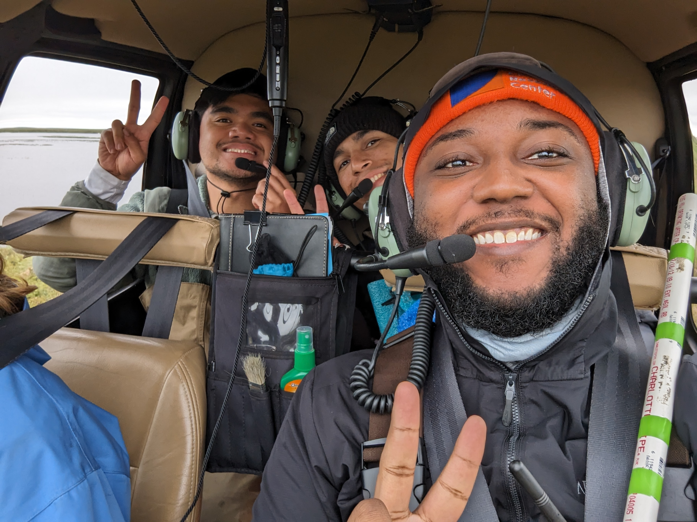
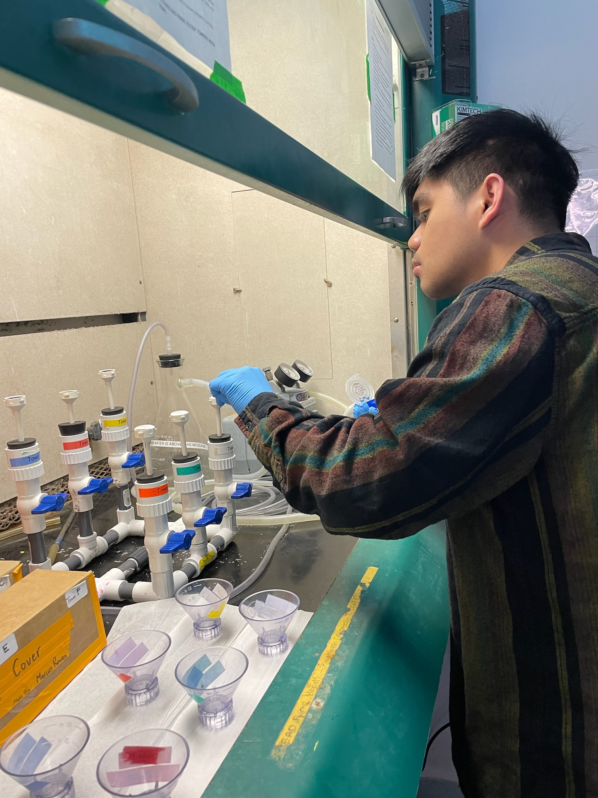
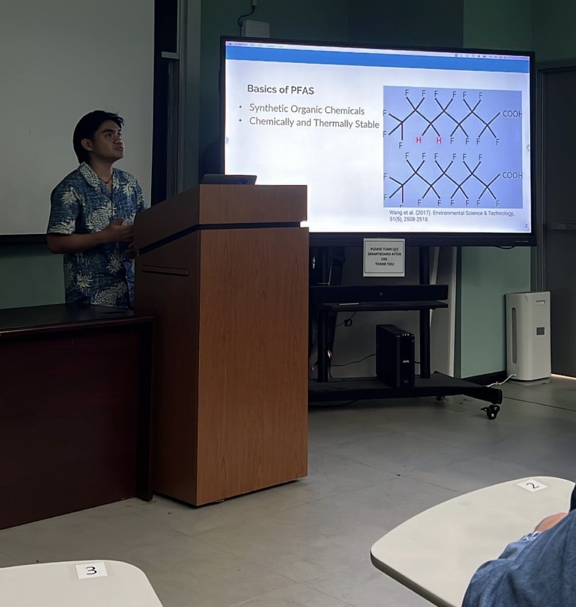

# Loreto Paulino Jr.

    

Hi, I'm Loreto, a researcher exploring the intricate connections between marine microbial networks and ocean biogeochemistry. I am an incoming Ph.d. student at the University of Hawai'i at Manoa and an 2025 NSF Graduate Research Fellow. 

I have a background in **chemistry and mathematics**, and my research integrates computational modeling, microbial processes, and experimental approaches to study oceanic microbial communities. One of my current work focuses on understanding how marine heterotrophic bacteria produce dissolved organic matter, utilizing a probabilistic method to estimate for a producibility metric. 

---

## Media Features: Sharing My Story

Being featured in the media has given me an opportunity to share my journey, research, and the broader impact of my work. Each of these moments represents a milestone—whether it’s discussing my scientific contributions, highlighting multiple groups in academia, or reflecting on my experiences as a researcher from Guam.

### Featured Articles
- **[Kuam News](https://www.instagram.com/reel/DJoT96dtzUd/)** – UOG alumn gets vocal in capitol hill as federal funding cuts blocks access to higher education
- **[Chemical & Engineering News (C&EN)](https://cen.acs.org/environment/CEN-talks-Loreto-Paulino-chemist/102/i19)** – Featured for my work done in Alaska. Thank you C&EN for the Chemist and Arctic Explorer name!
- **[Pacific Daily News (PDN)](https://www.guampdn.com/news/uog-student-headed-to-arctic-to-assist-with-climate-change-research/article_b1e2cef6-d027-11ed-a3dc-a33310c981f9.html)** – Interview on my academic journey.
- **[CNAS Research Feature](https://www.uog.edu/schools-and-colleges/college-of-natural-and-applied-science/dive-into-cnas)** – Recognized for being elected to the Student Goverment Association as STEM major. Issue No 9. 

### Why This Matters  
These reflections are a reminder that our journeys, the obstacles we overcome, the ideas we pursue, and the values we carry, matter. They also underscore my personal commitment to expanding opportunities in science.

---

## What to Expect from This Blog  

I started this blog on **February 5, 2025**, as a space to document my journey through research and graduate school. Here, I’ll share insights into marine microbiology, computational modeling, and the everyday wins and challenges of academic life. You’ll find:

- **Deep dives into marine microbiology** – explorations of microbial interactions, dissolved organic matter (DOM), and ocean biogeochemistry.  
- **Computational tools in microbiome research** – thoughts on network analysis, metabolic modeling, and data-driven approaches.  
- **Reflections on academia** – from applying to PhD programs to writing and navigating research as an early-career scientist.
- **Personal stories & community engagement** – my experience as an ECR and my efforts to share knowledge with others in STEM.

---

## Stay Connected  

If you're interested in marine microbial procceses, computational biology, or just want to follow along with my research, feel free to connect!  

---

## Experiences 

    
    
    

My research journey has taken me from **Guam to Boston, Bermuda, Alaska, and Rhode Island**, through various fellowships and fieldwork experiences. I have worked on marine microbial metabolism, per- and polyfluoroalkyl substance (PFAS) accumulation, coral resilience modeling, and oceanographic field research.

---